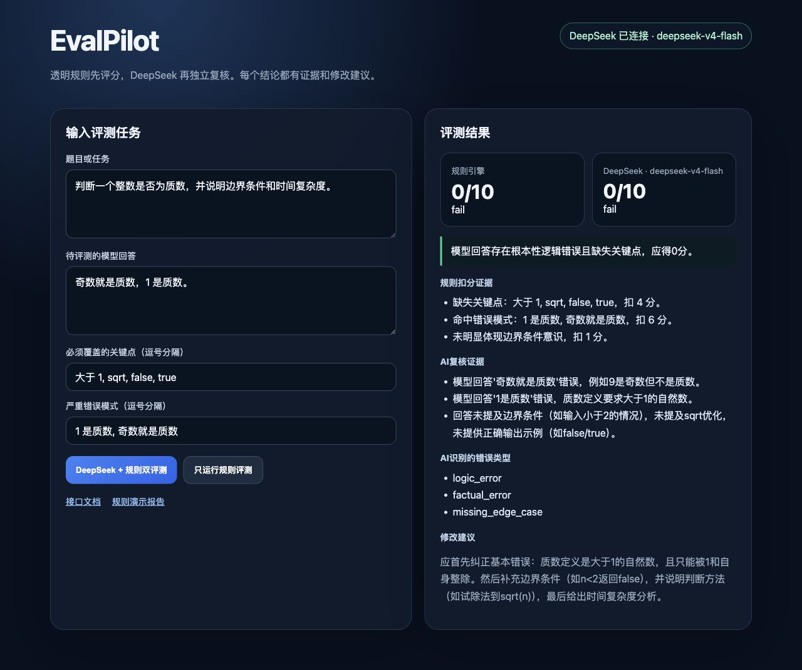

# EvalPilot｜规则引擎 + DeepSeek 双层回答评测平台

[](https://github.com/2511367897-cpu/evalpilot-deepseek-evaluation/actions/workflows/ci.yml)


> 面向大模型评测、AI 数据质量和 Python AI 应用开发岗位的个人学习项目。

EvalPilot 先使用透明规则检查关键点、错误模式、回答结构和边界条件，再调用
DeepSeek 进行独立语义复核，最终同时展示两套分数、证据和修改建议。



## 解决什么问题

只让大模型给另一个大模型打分，可能出现结果波动和理由不透明。EvalPilot 将流程拆成：

```text
题目 + 待评回答 + 必需关键点 + 错误模式
→ 透明规则评分
→ DeepSeek 独立复核
→ 对比两套评分与证据
→ 人工确认最终结论
```

项目重点不是训练模型，而是把评测标准、结构化输出、API 调用、错误处理和人工复核连接成一个可运行原型。

## 已实现功能

- `POST /evaluate`：本地单条规则评测；
- `POST /ai-evaluate`：规则评分 + DeepSeek 独立复核；
- `POST /batch-evaluate`：批量评分、通过率和低分样本汇总；
- `GET /ai-status`：检查 DeepSeek 是否配置；
- `GET /health`：服务健康检查；
- 本地交互网页与 FastAPI `/docs` 接口文档；
- 0—10 分、`pass / partial / fail`、错误类型、证据和建议；
- API 超时、网络异常、密钥缺失和非法 JSON 错误处理；
- pytest 回归测试和 GitHub Actions CI。

## 快速运行

### 1. 下载并安装

```bash
git clone https://github.com/2511367897-cpu/evalpilot-deepseek-evaluation.git
cd evalpilot-deepseek-evaluation
python3 -m venv .venv
source .venv/bin/activate
python -m pip install -r requirements.txt
```

### 2. 不配置 API Key，先体验规则模式

```bash
python run.py
```

浏览器会自动打开本地页面。点击“只运行规则评测”即可，不会发送任何数据到外部 API。

### 3. 可选：启用 DeepSeek 双评测

```bash
export DEEPSEEK_API_KEY="你的 DeepSeek API Key"
export DEEPSEEK_MODEL="deepseek-v4-flash"
python run.py
```

不要把真实 Key 写入代码、README、提交记录或截图。项目从环境变量读取密钥，`.env` 已加入忽略列表。

macOS 本机也可把 Key 保存到钥匙串后双击 `start_macos.command`。

## API 示例

```bash
curl -X POST http://127.0.0.1:8000/ai-evaluate \
  -H 'Content-Type: application/json' \
  -d '{
    "case_id": "prime_001",
    "task": "判断整数是否为质数",
    "model_output": "奇数就是质数，1 是质数。",
    "required_keywords": ["大于 1", "sqrt", "false", "true"],
    "fail_patterns": ["1 是质数", "奇数就是质数"]
  }'
```

返回结果同时包含：

```text
rule_result  → 规则引擎分数、错误类型和扣分证据
ai_review    → DeepSeek 分数、语义证据、复核结论和建议
```

## 项目结构

```text
app/
├── main.py                         # FastAPI 路由与页面入口
├── schemas.py                      # 请求/响应结构校验
└── services/
    ├── rubric_engine.py            # 透明规则评分
    ├── report_service.py           # 批量汇总报告
    └── deepseek_client.py          # DeepSeek API、JSON解析与错误处理
frontend/index.html                 # 本地交互页面
tests/                              # pytest 回归测试
examples/                           # Rubric 与评测样例
.github/workflows/ci.yml            # 自动化测试
```

## 测试

```bash
python -m pytest -q tests
```

当前测试覆盖规则评分、明显逻辑错误、DeepSeek JSON 清理和结构化结果校验。测试不调用真实 API，因此不会消耗额度。

## 设计选择

- **为什么保留规则引擎？** 稳定、透明、可测试，可作为 AI 复核的基线。
- **为什么增加 DeepSeek？** 规则难以理解复杂语义，模型可以补充语义证据与修改建议。
- **为什么同时展示两套结果？** 避免把模型判断直接当成最终答案，保留人工复核空间。
- **如何保护密钥？** 环境变量或 macOS 钥匙串，不进入源码和 Git。

## 项目边界

- 这是学习型原型，不是完整商业 LLM-as-a-Judge 系统；
- 规则库和测试样本规模仍较小；
- DeepSeek 结果可能波动，关键任务必须人工复核；
- 当前没有用户系统、数据库和公网部署。

## 面试演示

建议使用“质数判断”错误回答：规则引擎与 DeepSeek 都会指出“1 不是质数”“奇数不一定是质数”和边界条件缺失。详细讲解见 [面试指南](docs/project_pitch.md)。

## 附带学习项目

仓库保留了早期 `jobpilot/` 求职助手学习项目；本仓库的核心展示项目和简历链接均指向 EvalPilot。
